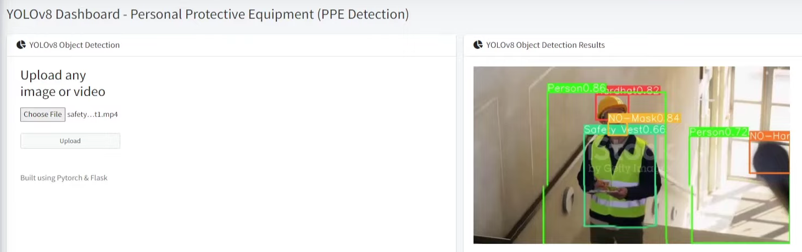

# YOLOv8-Object-Detection

# Result


# How to run?
### STEPS:

Clone the repository

```bash
https://github.com/shashank1202/YOLOv8-Object-Detection
```
### STEP 01- Create a conda environment after opening the repository

```bash
conda create -n project2 python=3.8 -y
```

```bash
conda activate project2
```

### STEP 02- install the requirements
```bash
pip install -r requirements.txt
```

```bash
# Finally run the following command
python webapp.py
```

Now,
```bash
open up you local host and port
```


```bash
Author: Shashank S
AI Engineer
Email: shashank.s.1202@gmail.com


